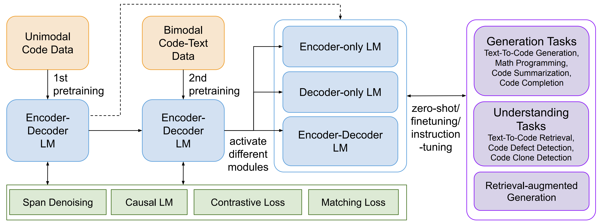
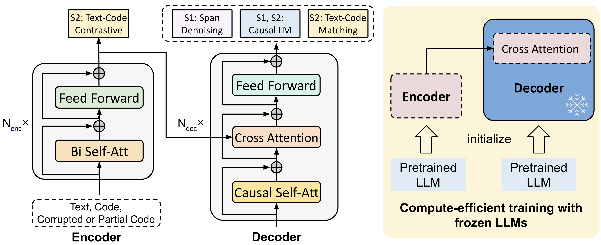

# CodeT5+

Official research release for the **CodeT5+** models (`220M`, `770M`, `2B`, `6B` `16B`) for a wide range of **Code Understanding and Generation** tasks.
Find out more via our [blog post](https://blog.salesforceairesearch.com/codet5-open-code-large-language-models/).

*Title*: [CodeT5+: Open Code Large Language Models for Code Understanding and Generation](https://arxiv.org/pdf/2305.07922.pdf)

*Authors*: [Yue Wang](https://yuewang-cuhk.github.io/)\*, [Hung Le](https://sites.google.com/view/henryle2018/home?pli=1)\*, [Akhilesh Deepak Gotmare](https://akhileshgotmare.github.io/), [Nghi D.Q. Bui](https://bdqnghi.github.io/), [Junnan Li](https://sites.google.com/site/junnanlics), [Steven C.H. Hoi](https://sites.google.com/view/stevenhoi/home) (* indicates equal contribution)


# What is this about?
CodeT5+ is a new family of open code large language models with an encoder-decoder architecture that can flexibly operate in different modes (i.e. _encoder-only_, _decoder-only_, and _encoder-decoder_) to support a wide range of code understanding and generation tasks.

To train CodeT5+, we introduce a diverse set of pretraining tasks including _span denoising_, _causal language modeling_, _contrastive learning_, and _text-code matching_ to learn rich representations from both unimodal code data and bimodal code-text data. 
Additionally, to efficiently scale up the model, we propose a simple yet effective _compute-efficient pretraining_ method to initialize our model with frozen off-the-shelf LLMs such as [CodeGen](https://github.com/salesforce/CodeGen). 
Furthermore, we explore instruction tuning to align the model with natural language instructions following [Code Alpaca](https://github.com/sahil280114/codealpaca). See the below overview of CodeT5+.



## Table of Contents

1. [Released Models](#released-models)
2. [How to Use?](#how-to-use)
3. [Instruction Tuning to Align with Natural Language Instructions](#instruction-tuning-to-align-with-natural-language-instructions)
4. [How to Finetune Using Your Own Data?](#how-to-finetune-using-your-own-data)
5. [Reproduce the Results](#reproduce-the-results)
   1. [HumanEval](#humaneval)
   2. [Text-to-Code Retrieval](#text-to-code-retrieval)
6. [Citation](#citation)


# Released Models
We implemented a family of CodeT5+ models, with model size ranging from 220M to 16B. 
Note that CodeT5+ `220M` and `770M` employ the same architecture of CodeT5-base and large respectively and are pretrained from scratch, while CodeT5+ `2B`, `6B`, `16B` employ a "_shallow encoder and deep decoder_" architecture with the shallow encoder initialized from CodeGen-mono 350M and the deep decoder initialized from CodeGen-mono 2B, 6B, 16B, respectively.
InstructCodeT5+ 16B is our instruction-tuned model from CodeT5+ 16B. 
Note that as this model utilizes instruction tuning data curated using OpenAI API, the checkpoint of InstructCodeT5+ 16B is licensed for research and **non-commercial** use only.

We release the following CodeT5+ models at Huggingface:
* CodeT5+ `110M` embedding model: [codet5p-110m-embedding](https://huggingface.co/Salesforce/codet5p-110m-embedding).
* CodeT5+ `220M` and `770M`: [codet5p-220m](https://huggingface.co/Salesforce/codet5p-220m) and [codet5p-770m](https://huggingface.co/Salesforce/codet5p-770m).
* CodeT5+ `220M` and `770M` that are further tuned on Python subset: [codet5p-220m-py](https://huggingface.co/Salesforce/codet5p-220m-py) and [codet5p-770m-py](https://huggingface.co/Salesforce/codet5p-770m-py).
* CodeT5+ `2B`, `6B`, `16B`: [codet5p-2b](https://huggingface.co/Salesforce/codet5p-2b), [codet5p-6b](https://huggingface.co/Salesforce/codet5p-6b), and [codet5p-16b](https://huggingface.co/Salesforce/codet5p-16b).
* InstructCodeT5+ `16B`: [instructcodet5p-16b](https://huggingface.co/Salesforce/instructcodet5p-16b).



# How to Use?
All CodeT5+ models and tokenizers can be easily loaded using the `AutoModelForSeq2SeqLM` and `AutoTokenizer` functionality. 
For tokenizers, CodeT5+ `220M` and `770M` employ the same tokenizer as the original [CodeT5](https://github.com/salesforce/CodeT5) while CodeT5+ `2B`, `6B`, `16B` employ the same tokenizer as [CodeGen]( https://github.com/salesforce/CodeGen).

For CodeT5+ `2B`, `6B`, `16B`, and InstructCodeT5+ `16B`, please set `trust_remote_code=True` when loading the models as the [model class](https://huggingface.co/Salesforce/codet5p-16b/blob/main/modeling_codet5p.py) is defined in the Huggingface repo.
Besides, these models would benefit from passing additional prompts to the decoder via `decoder_input_ids` to achieve better generation performance.


```python
from transformers import AutoModelForSeq2SeqLM, AutoTokenizer
import torch

checkpoint = "Salesforce/instructcodet5p-16b"
device = "cuda" # for GPU usage or "cpu" for CPU usage

tokenizer = AutoTokenizer.from_pretrained(checkpoint)
model = AutoModelForSeq2SeqLM.from_pretrained(checkpoint,
                                              torch_dtype=torch.float16,
                                              low_cpu_mem_usage=True,
                                              trust_remote_code=True).to(device)

encoding = tokenizer("def print_hello_world():", return_tensors="pt").to(device)
encoding['decoder_input_ids'] = encoding['input_ids'].clone()
outputs = model.generate(**encoding, max_length=15)
print(tokenizer.decode(outputs[0], skip_special_tokens=True))
```

### CodeT5+ embedding model 🔥
Apart from the generative models, we also release the [CodeT5+ 110M embedding](https://huggingface.co/Salesforce/codet5p-110m-embedding) model that can be used to extract code embeddings. This checkpoint contains an encoder of the CodeT5+ 220M model that are pretrained from two stages on both unimodal and bimodal data, as well as a linear projection layer to map the encoder output to a 256-dimensional vector. 

```python
from transformers import AutoModel, AutoTokenizer

checkpoint = "Salesforce/codet5p-110m-embedding"
device = "cuda"  # for GPU usage or "cpu" for CPU usage

tokenizer = AutoTokenizer.from_pretrained(checkpoint, trust_remote_code=True)
model = AutoModel.from_pretrained(checkpoint, trust_remote_code=True).to(device)

inputs = tokenizer.encode("def print_hello_world():\tprint('Hello World!')", return_tensors="pt").to(device)
embedding = model(inputs)[0]
print(f'Dimension of the embedding: {embedding.size()[0]}, with norm={embedding.norm().item()}')
# Dimension of the embedding: 256, with norm=1.0
```

# Instruction Tuning to Align with Natural Language Instructions

We explore instruction tuning to align CodeT5+ with natural language instructions following [Code Alpaca](https://github.com/sahil280114/codealpaca). First download the instruction data `code_alpaca_20k.json` from [here](https://github.com/sahil280114/codealpaca/tree/master/data). 
Then, you can run the following command to finetune CodeT5+ 16B on the instruction data.

```bash
MODEL=Salesforce/codet5p-16b
SAVE_DIR=saved_models/instructcodet5p-16b

deepspeed instruct_tune_codet5p.py \
  --load $MODEL --save-dir $SAVE_DIR --instruct-data-path code_alpaca_20k.json \
  --fp16 --deepspeed deepspeed_config.json
```

# How to Finetune Using Your Own Data?

We provide an example finetuning script [tune_codet5p_seq2seq.py](https://github.com/salesforce/CodeT5/blob/main/CodeT5%2B/tune_codet5p_seq2seq.py) for CodeT5+ models on Seq2Seq LM task. 
After installing the `transformers` and `datasets` libraries, you can run `python tune_codet5p_seq2seq.py` to finetune CodeT5+ models on any Seq2Seq LM tasks such as Python code summarization as illustrated in the script. 
To finetune on your own data, you just need to prepare your customized data in the `datasets` format and pass its path to `--cache-data`.

Besides, you can specify `--load` to select the specific CodeT5+ model (e.g., `Salesforce/codet5p-220m`) to finetune from. To tune the hyper-parameter setting that suit your task the best, you can customize other finetuning arguments such as  `--epochs`, `--lr`, `--lr-warmup-steps`, `--max-source-len`, `--max-target-len`, `--batch-size-per-replica`, `--grad-acc-steps`, etc.
This script naturally supports both single-GPU and multi-GPU training. If you have limited GPU memory issue and want to improve the training throughput, please consider to specify `--fp16` to enable mixed-precision training and use [DeepSpeed](https://github.com/microsoft/DeepSpeed) for further optimization by passing a deedspeed config file to `--deepspeed` (see [here](https://huggingface.co/docs/transformers/main_classes/deepspeed#zero2-example) for an example config file).

# Reproduce the Results

## HumanEval
Our CodeT5+ models achieve very strong results on HumanEval benchmark in zero-shot setting. We follow common practices to employ nucleus sampling with different temperature `T` for computing `Pass@k` (`T=0.2,0.6,0.8` for `k=1,10,100` respectively).

| Model                   | Pass@1   | Pass@10  | Pass@100 |
|-------------------------|----------|----------|----------|
| LLaMA 7B                | 10.5     | -        | 36.5     |
| LaMDA  137B             | 14.0     | -        | 47.3     |
| InCoder 6B              | 15.2     | 27.8     | 47.0     |
| GPT-NeoX 20B            | 15.4     | 25.6     | 41.2     |
| **CodeT5+ 770M**        | 15.5     | 27.2     | 42.7     |
| LLaMA 13B               | 15.8     | -        | 52.5     |
| PaLM  62B               | 15.9     | -        | 46.3     |
| AlphaCode 1.1B          | 17.1     | 28.2     | 45.3     |
| LLaMA 33B               | 21.7     | -        | 70.7     |
| Replit 3B               | 21.9     | -        | -        |
| CodeGeeX 13B            | 22.9     | 39.6     | 60.9     |
| LLaMA 65B               | 23.7     | -        | 79.3     |
| PaLM  540B              | 26.2     | -        | 76.2     |
| CodeGen-mono 16B        | 29.3     | 49.9     | 75.0     |
| **CodeT5+ 16B**         | 30.9     | 51.6     | 76.7     |
| code-cushman-001        | 33.5     | 54.3     | 77.4     |
| StarCoder 15B           | 33.6     | -        | -        |
| **InstructCodeT5+ 16B** | **36.1** | **57.1** | **80.7** |

Please follow the instructions below to reproduce the results.

---

### Installation
* Install the official HumanEval evaluation tool released by OpenAI following the instructions in this [repo](https://github.com/openai/human-eval).
* Install the Pytorch (version `1.13.1`) and transformers (version `4.21.3`) libraries.

### Generating programs from CodeT5+ models
`cd humaneval` then run the inference via `bash run_generate.sh`. 
You can select the model to generate from by changing the `model` variable in the script.
Following the original setting in the HumanEval paper, we generate 200 programs (`pred_num=200`) for each problem and employs nucleus sampling with different temperature `T` for computing `Pass@k` (`T=0.2,0.6,0.8` for `k=1,10,100` respectively).
The generated programs will be saved in `preds/${model}_T${T}_N${pred_num}`.

```bash
model=instructcodet5p-16b
temp=0.2
max_len=800
pred_num=200
num_seqs_per_iter=2 # 25 for 350M and 770M, 10 for 2B, 8 for 6B, 2 for 16B on A100-40G

output_path=preds/${model}_T${temp}_N${pred_num}

mkdir -p ${output_path}
echo 'Output path: '$output_path
echo 'Model to eval: '$model

# 164 problems, 21 per GPU if GPU=8
index=0
gpu_num=8
for ((i = 0; i < $gpu_num; i++)); do
  start_index=$((i * 21))
  end_index=$(((i + 1) * 21))

  gpu=$((i))
  echo 'Running process #' ${i} 'from' $start_index 'to' $end_index 'on GPU' ${gpu}
  ((index++))
  (
    CUDA_VISIBLE_DEVICES=$gpu python generate_codet5p.py --model Salesforce/${model} \
      --start_index ${start_index} --end_index ${end_index} --temperature ${temp} \
      --num_seqs_per_iter ${num_seqs_per_iter} --N ${pred_num} --max_len ${max_len} --output_path ${output_path}
  ) &
  if (($index % $gpu_num == 0)); then wait; fi
done
```

### Evaluating Pass@k
`cd humaneval` then run the evaluation via `bash run_eval.sh`.

```bash
output_path=preds/instructcodet5p-16b_T0.2_N200

echo 'Output path: '$output_path
python process_preds.py --path ${output_path} --out_path ${output_path}.jsonl

evaluate_functional_correctness ${output_path}.jsonl
```

Note that the reproduced results might be slightly different from the reported ones due to the randomness of the sampling process. We also released the model predictions for our [InstructCodeT5+ 16B](https://huggingface.co/Salesforce/instructcodet5p-16b) at `humaneval/instructcodet5p-16b_T0.2_N200.jsonl` for your reference. 
It can reproduce the results of `36.1% Pass@1` with the following command. 

```bash
evaluate_functional_correctness humaneval/instructcodet5p-16b_T0.2_N200.jsonl
```

## Text-to-Code Retrieval
* Download and preprocess 3 text-to-code retrieval datasets following the instructions in this [repo](https://github.com/microsoft/CodeBERT/tree/master/UniXcoder/downstream-tasks/code-search#data-download).
* `cd code_retrieval` then run the evaluation of our CodeT5+ 110M embedding model via `bash run_retrieval.sh`. 

```bash
# LANG choices: ruby javascript go python java php AdvTest cosqa
LANG=ruby
BS=256
CODE_LEN=360
TEXT_LEN=64
MODEL_NAME=Salesforce/codet5p-110m-embedding
DATA_DIR=/path/to/data

TRG_DIR=saved_models/${LANG}/codet5p_110m_embedding_TL${TEXT_LEN}_CL${CODE_LEN}
mkdir -p $TRG_DIR
echo 'Target dir: '$TRG_DIR

python eval_contrast_retrieval.py --model_name $MODEL_NAME --lang $LANG --output_dir $TRG_DIR \
  --data_dir $DATA_DIR --max_text_len $TEXT_LEN --max_code_len $CODE_LEN --batch_size $BS
```

### Zero-shot Evaluation Results

The above running script can reproduce the results as shown in the `CodeT5+ 110M embedding` row of the following table. We will release the `CodeT5+ 220M matching` model soon, which shares the same encoder as the embedding model. It achieves better performance than the embedding model via leveraging the fine-grained alignment between text and code through the matching decoder.
For UniXcoder's zero-shot results, we reproduce it following its official instructions [here](https://github.com/microsoft/CodeBERT/tree/master/UniXcoder/downstream-tasks/code-search#zero-shot-setting).


| Model                  | Ruby  | JavaScript | Go    | Python | Java  | PHP   | CSN_Avg | CosQA | AdvTest |
| ---------------------- | ----- | ---------- | ----- | ------ | ----- | ----- | ------- | ----- |--------|
| UniXcoder 125M         | 57.6  | 44.2       | 64.8  | 44.7   | 46.6  | 37.3  | 49.20   | 43.1  | 29.9   |
| CodeT5+ 110M embedding | 74.51 | 69.07      | 90.69 | 71.55  | 71.82 | 67.72 | 74.23   | 39.57 | 40.49  |
| CodeT5+ 220M matching  | 75.94 | 69.85      | 91.32 | 73.97  | 74.7  | 68.28 | 75.68   | 51.54 | 42.03  |

* Note that the reported zero-shot results of CodeT5+ are different from the ones in the paper which are task-specific fine-tuned results.

# Citation

```bibtex
@article{wang2023codet5plus,
  title={CodeT5+: Open Code Large Language Models for Code Understanding and Generation},
  author={Wang, Yue and Le, Hung and Gotmare, Akhilesh Deepak and Bui, Nghi D.Q. and Li, Junnan and Hoi, Steven C. H.},
  journal={arXiv preprint},
  year={2023}
}
```
