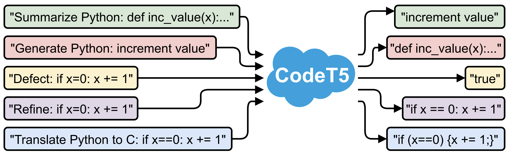

# CodeT5: Identifier-aware Unified Pre-trained Encoder-Decoder Models for Code Understanding and Generation
This is the official PyTorch implementation for the following EMNLP 2021 paper from Salesforce Research: \
**Title**: [CodeT5: Identifier-aware Unified Pre-trained Encoder-Decoder Models for Code Understanding and Generation](https://arxiv.org/pdf/2109.00859.pdf) [[blog]](https://blog.einstein.ai/codet5/) \
**Authors**: Yue Wang, Weishi Wang, Shafiq Joty, Steven C.H. Hoi \
**Abstract**: 
Pre-trained models for Natural Languages (NL) like BERT and GPT have been recently shown to transfer well to Programming Languages (PL) and largely benefit a broad set of code-related tasks. Despite their success, most current methods either rely on an encoder-only (or decoder-only) pre-training that is suboptimal for generation (resp. understanding) tasks or process the code snippet in the same way as NL, neglecting the special characteristics of PL such as token types. We present CodeT5, a unified pre-trained encoder-decoder Transformer model that better leverages the code semantics conveyed from the developer-assigned identifiers. Our model employs a unified framework to seamlessly support both code understanding and generation tasks and allows for multi-task learning. Besides, we propose a novel identifier-aware pre-training task that enables the model to distinguish which code tokens are identifiers and to recover them when they are masked. Furthermore, we propose to exploit the user-written code comments with a bimodal dual generation task for better NL-PL alignment. Comprehensive experiments show that CodeT5 significantly outperforms prior methods on understanding tasks such as code defect detection and clone detection, and generation tasks across various directions including PL-NL, NL-PL, and PL-PL. Further analysis reveals that our model can better capture semantic information from code. 



**Updates**
- :white_check_mark: Integrated to [Huggingface Spaces](https://huggingface.co/spaces) with [Gradio](https://github.com/gradio-app/gradio). See [Gradio Web Demo](https://huggingface.co/spaces/akhaliq/codet5).

## Requirements
* Pytorch==1.7.1
* tensorboard==2.4.1
* transformers==4.6.1
* tree-sitter==0.2.2 
 
## Download 
* [Pre-trained checkpoints & Fine-tuning data](https://console.cloud.google.com/storage/browser/sfr-codet5-data-research)

## File Structure
```
├── CODE_OF_CONDUCT.md
├── README.md
├── SECURITY.md
├── CodeT5.png
├── _utils.py
├── configs.py
├── models.py
├── run_clone.py
├── run_gen.py
├── utils.py
├── LICENSE.txt
├── data
│   ├── clone
│   ├── concode
│   ├── defect
│   ├── refine
│   │   ├── medium
│   │   └── small
│   ├── summarize
│   │   ├── go
│   │   ├── java
│   │   ├── javascript
│   │   ├── php
│   │   ├── python
│   │   └── ruby
│   └── translate
├── evaluator
│   ├── bleu.py
│   ├── smooth_bleu.py
│   └── CodeBLEU
├── pretrained_models
│   └── codet5_base
│   └── codet5_small
├── sh
│   ├── exp_with_args.sh
│   ├── run_exp.py
│   ├── results
│   ├── saved_models
│   └── tensorboard
└── tokenizer
    └── salesforce
        ├── codet5-merges.txt
        └── codet5-vocab.json    
```

## Fine-tuning
Go to `sh` folder, set the `WORKDIR` in `exp_with_args.sh` to be your downloaded CodeT5 repository path.
 
You can use `run_exp.py` to run a broad set of experiments by simply passing the `model_tag`, `task`, and `sub_task` arguments. 
In total, we support four models (i.e., ['roberta', 'codebert', 'codet5_small', 'codet5_base']) and six tasks (i.e., ['summarize', 'concode', 'translate', 'refine', 'defect', 'clone']). 
For each task, we use the `sub_task` to specify which specific datasets to fine-tine on.
 
For example, if you want to run CodeT5-base on the code summarization task for Ruby, you can type the following command:
```
python run_exp.py --model_tag codet5_base --task summarize --sub_task ruby
```

Besides, you can specify:
```
model_dir: where to save fine-tuning checkpoints
res_dir: where to save the performance results 
summary_dir: where to save the training curves
data_num: how many data instances to use, the default -1 is for using the full data
gpu: the index of the GPU to use in the cluster
``` 
You can also directly revise the suggested arguments in the `get_args_by_task_model` function of `run_exp.py`. The saved training curves in `summary_dir` can be visualized using [tensorboard](https://pypi.org/project/tensorboard/).

## Citation
If you find this code to be useful for your research, please consider citing.
```
@article{CodeT5,
      title={CodeT5: Identifier-aware Unified Pre-trained Encoder-Decoder Models for Code Understanding and Generation}, 
      author={Yue Wang, Weishi Wang, Shafiq Joty, Steven C.H. Hoi},
      year={2021},
      journal={arXiv preprint arXiv:2109.00859},
}
```
